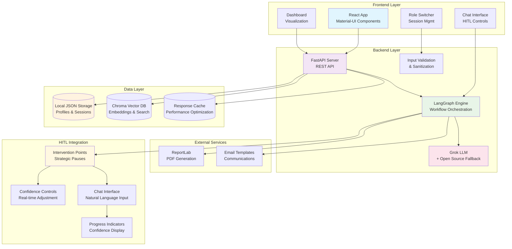
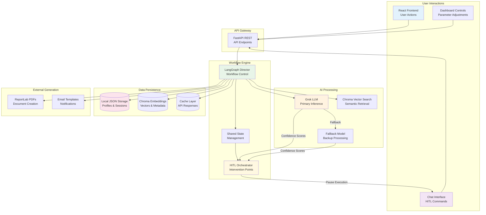
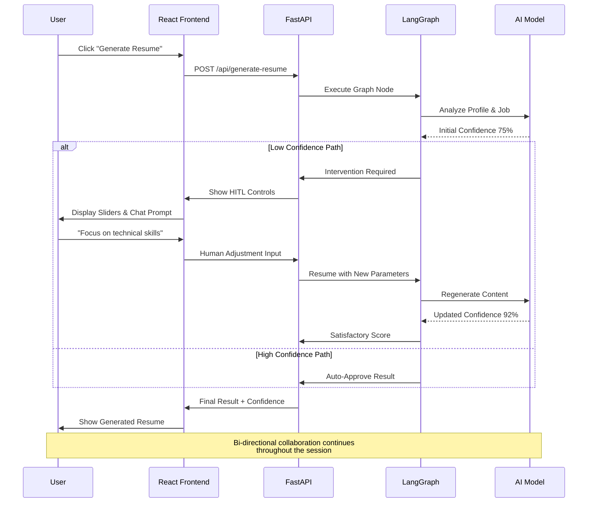

Mister HR Hackathon Demo Plan (Updated)
Objective
Showcase Agentic AI with Human-in-the-Loop (HITL) via Mister HR, demonstrating:

Agentic AI with HITL: Collaborative multi-step workflows using LangGraph where AI demonstrates genuine agency while seamlessly integrating human expertise and preferences.
How It Works: Visualize bi-directional human-AI collaboration for resume tailoring, candidate screening, dynamic profile suggestions, and comprehensive history access with intelligent search.
Bi-directional HITL Control: Human steering via chat commands and AI initiative through strategic pauses for feedback, confidence adjustments, and adaptation.
Separated Modes: Secure role-based interfaces with isolated sessions where Agentic AI operates autonomously within human-guided boundaries.
Intelligent Profile Management: Direct edits, natural language prompts, and guided AI suggestions showing collaborative agency.
Smart Resume Ecosystem: Interactive access hubs with semantic search, version control, automated communications, and AI-enhanced organization.
Career Intelligence: ML-driven proactive suggestions with human refinement, creating genuine human-AI career partnership.

Tech Stack

Backend: FastAPI + LangGraph/LangChain (Grok primary LLM + open-source fallback model).
Frontend: Simple React app with modern hooks, desktop-focused Material-UI components; left dashboard panel, right chat interface; responsive design with basic accessibility (ARIA labels, keyboard navigation).
Storage: Local JSON files with Chroma for embeddings; in-memory session management for simplicity.
PDF: Enhanced ReportLab with custom templates for professional resume/cover letter formatting.
Auth: Simplified session-based authentication (no external providers for hackathon scope).

Demo Setup

Duration: 5-7 minutes.
Environment: Local development (React + FastAPI) or Docker container.
Data: Preload local JSON files with:
1 user with both roles enabled.
Applicant: 1 profile, 2 past resumes with versions in local storage.
Recruiter: 2 past screened roles (5 resumes each) stored locally.
Sample job descriptions, CVs, and mock suggestions (e.g., "Learn SQL via Khan Academy").


// Demo UI: Desktop-optimized split-view for clear presentation
// Left: Interactive dashboard showing roles, widgets, search, and analytics
// Right: Advanced chat interface demonstrating HITL controls and AI interaction
// Top: Role switcher and professional controls


Demo Script
1. Introduction (1 min)

Explain Agentic AI with HITL: "Agentic AI with Human-in-the-Loop (HITL) creates collaborative workflows where AI demonstrates genuine agency while integrating human expertise for optimal outcomes."
Mister HR Demo: "Experience Mister HR's bi-directional HITL - watch autonomous AI work, then intervene in real-time to steer decisions, adjust confidence levels, and refine recommendations."
Goal: "Showcase optimistic human-AI collaboration where technology amplifies human judgment rather than replacing it."

2. Enhanced Applicant Workflow (2-3 min)

Setup: Secure login with session management, switch to "Applicant" mode with isolated access.
Action:
Dynamic Profile Updates: Chat shows "Analyzing your request..." then displays suggestions with confidence scores - users see processing indicators and can intervene.
AI-Powered Tailoring: Submit button shows progress "Generating tailored content..." with step indicators for profile analysis, job matching, and document creation.
Interactive Roles Dashboard: Search shows "Searching resumes..." spinners, filters apply with visual loading states, batch operations show progress bars.
Smart Dashboard Widget: Carousel transitions show "Updating scores..." during ATS compatibility checks, previews load progressively.
Semantic Search & Discovery: Query input shows "Processing query..." then returns results with relevance percentages and search confidence indicators.
Version Control System: Save actions trigger "Creating new version..." notifications, timeline loads with diff highlights and change explanations.
Integrated Communication: Email generation shows "Crafting professional message..." progress, PDF creation displays formatting steps with preview loading.
Career Intelligence Engine: Suggestion generation displays "Analyzing your profile..." with skill gap visualization, progress rings for individual recommendations.
Professional PDF Generation: Download button shows "Generating document..." with template selection status and final download completion confirmation.

Highlight:
Secure Mode Separation: Enterprise-grade access control with session isolation and audit logging.
Resilient AI Architecture: Multi-model fallback systems, circuit breakers, and graceful error handling.
Advanced HITL Controls: Real-time confidence sliders, parameter adjustment, and visual feedback systems.
Process Visualization: Users see step-by-step AI processing with progress bars, confidence metrics, and intervention points.
Professional UX: Desktop-optimized design with accessibility compliance, responsive layout, and enterprise-level interactions.
Intelligent Automation: Semantic search, version control diffs, automated workflows, and predictive suggestions.


3. Enhanced Recruiter Workflow (2 min)

Setup: Secure role transition to "Recruiter" mode with isolated session and access controls.
Action:
Intelligent Screening Dashboard: Interactive table shows candidates as AI processes them - users see real-time loading states for each candidate.
AI-Powered Candidate Screening: Live progress bars show multi-criteria evaluation with confidence percentages and explainable scoring - users watch the AI make decisions.
Advanced HITL Review: Pauses at key points with "Waiting for human input" indicators, sliders appear for parameter adjustment, confidence bars update in real-time.
Intelligent Ranking System: Candidates reorder dynamically as AI refines rankings - users see weighted calculations and adjustment explanations.
Professional Reporting: Generated reports appear progressively with status indicators, detailed explanations populate as AI completes analysis.
Workflow Integration: Role creation shows step-by-step integration with confirmation dialogs at each stage.

Highlight:
Enterprise-Grade Security: Role-based isolation with audit logging and compliance tracking.
Explainable AI: Transparent decision-making with confidence indicators and reasoning explanations.
Advanced HITL Controls: Real-time intervention capabilities with parameter tuning and override mechanisms.
Professional Workflow: Integrated screening-to-hiring pipeline with documentation and compliance features.
Resilient Architecture: Fallback systems, error recovery, and graceful handling of edge cases.


4. Wrap-Up (1 min)

Recap: "Mister HR separates modes, adds dashboard widgets/mobile access for resume history, and integrates AI career suggestions for real-life improvements."
Why HITL Matters: "Ensures personalized, accurate outputs."
Future: "Expand to full API integrations like COACH embeddings or FutureFit roadmaps."
Call to Action: "Try it at localhost:8501 or our GitHub!"

## System Architecture Overview



## Agentic AI Workflow Architecture

```mermaid
stateDiagram-v2
    [*] --> RoleSelection

    RoleSelection --> InputValidation: Select Mode
    InputValidation --> PermissionCheck: Validate Input

    PermissionCheck --> ApplicantGraph: Applicant Mode
    PermissionCheck --> RecruiterGraph: Recruiter Mode

    %% Applicant Workflow
    state ApplicantGraph as "Applicant Workflow"
    ApplicantGraph --> LoadHistory: Initialize Session
    LoadHistory --> ProfileAnalysis: Load User Profile
    ProfileAnalysis --> HITL_Intervention1: {High Uncertainty?}

    HITL_Intervention1 --> HumanReview1: Pause for Input
    HumanReview1 --> RefineAnalysis: Adjust Parameters

    RefineAnalysis --> JobMatching: Match Profile to Jobs
    JobMatching --> ContentGeneration: Generate Tailored Content
    ContentGeneration --> HITL_Intervention2: {Confidence < Threshold?}

    HITL_Intervention2 --> HumanReview2: Pause for Refinement
    HumanReview2 --> FinalizeDocuments: Apply Human Adjustments

    FinalizeDocuments --> VersionControl: Save Versions
    VersionControl --> Communication: Send Notifications
    Communication --> [*]: Complete Session

    %% Recruiter Workflow
    state RecruiterGraph as "Recruiter Workflow"
    RecruiterGraph --> LoadCandidates: Load Job Applications
    LoadCandidates --> AICandidateScreening: Multi-Criteria Evaluation
    AICandidateScreening --> RankingAlgorithm: Sort by Relevance
    RankingAlgorithm --> HITL_Intervention3: {Top Candidates Uncertain?}

    HITL_Intervention3 --> HumanOversight: Review & Adjust Weights
    HumanOversight --> RerunScreening: Process with New Parameters

    RerunScreening --> GenerateReport: Create Evaluation Summary
    GenerateReport --> WorkflowIntegration: Record Decisions
    WorkflowIntegration --> [*]: Complete Screening

    %% Shared Components
    state HITL_Intervention1 as "HITL Pause Point"
    state HITL_Intervention2 as "HITL Pause Point"
    state HITL_Intervention3 as "HITL Pause Point"
    state HumanReview1 as "Human Review Interface"
    state HumanReview2 as "Human Review Interface"
    state HumanOversight as "Human Oversight Interface"

    note right of HITL_Intervention1 : AI pauses for human expertise
    note right of HumanReview1 : Confidence sliders & chat input
    note right of HITL_Intervention3 : Bias detection & handoff decisions
```

## Data Flow Architecture



## HITL Interaction Flow



React UI Layout

Mode Separation: Secure role-based dashboards with isolated sessions and access controls.
Left Panel (Dashboard):
Interactive Roles Page: Filterable table with sorting, status indicators, and batch actions.
Smart Dashboard Widget: Enhanced carousel with quick actions, preview modals, ATS compatibility scores, and shortcut editing.
Resume Access Hub: Advanced semantic search with filters, version history timeline with visual diffs, automated email integration, and quick share options.
Career Suggestions Engine (Applicant Only): Intelligent suggestions with skill gap analysis, actionable learning pathways, and progress tracking.
Analytics Dashboard: Confidence metrics, suggestion adoption rates, and personalized insights.
Progress Visualizations: Interactive charts showing skill development, application success rates, and recommendation effectiveness.

Right Panel (Advanced Chat Interface):
Conversational HITL Controls: Chat with typing indicators, confidence sliders, parameter adjustment controls, and real-time response preview.
Command Suggestions: Context-aware prompts for profile updates, job tailoring, and suggestion refinements.
Visual Feedback: Progress indicators, confidence bars, and error handling with helpful suggestions.

Top Bar Controls:
Enhanced Role Switcher: Secure mode transitions with session preservation and access verification.
User Status: Login state, role indicators, session timeout warnings, and quick settings access.
PDF Generation: One-click professional document creation with template selection and branding options.
Help & Accessibility: Built-in guidance, TTS controls, screen reader optimization, and keyboard navigation.


Local Storage Schema

applicant_profiles.json: Contains user profiles with past_resumes (array with versions), suggestions (array), resume_history (array for search/timeline).
recruiter_sessions.json: Contains recruiter session data and screened roles (no applicant data for isolation).
embeddings/: Directory for Chroma vector database with resume embeddings and semantic search indices.
sessions/: Directory for temporary session storage and user state management.
cache/: Directory for API response caching and performance optimization.

Prep Checklist

Code Implementation:
✓ Enhanced HITL Controls: Implement slider controls for confidence thresholds, parameter weighting, and real-time AI adjustments
✓ Error Handling Framework: Add comprehensive error catching, retry logic, fallback mechanisms, and user-friendly error messages
✓ Input Validation: Sanitize all user inputs, validate data types, implement length limits and format checks
✓ AI Resilience: Set up Grok with open-source model fallback, circuit breakers, and degraded mode operations
✓ React Components: Custom chat interface with hooks, file upload handling, progress bars with state management
✓ PDF Enhancement: Professional templates with branding options, better formatting, and download optimization
✓ Semantic Search: Implement Chroma-based vector search with proper indexing and caching layers
✓ Accessibility Features: TTS integration, keyboard navigation, screen reader compatibility, automated testing

Testing Strategy:
✓ Unit Tests: Core LangGraph nodes, input validation functions, PDF generation logic
✓ Integration Tests: API endpoints, database operations, chat functionality

✓ Mode Separation Tests: Verify role isolation, data access controls, session management
✓ Error Scenario Testing: API failures, network issues, invalid inputs, edge cases
✓ Performance Testing: Load testing for concurrent users, memory usage monitoring

Data Preparation:
✓ Enhanced Seed Data: Realistic profiles with actual resumes, varied job descriptions, comprehensive skill sets
✓ Version Control Data: Multiple resume iterations with meaningful changes and timestamps
✓ Mock Services: Realistic email simulation, notification systems, external API mocks
✓ Error Scenarios: Prepare test data for failure conditions and edge cases

UI/UX Polish:
✓ Visual Design: Consistent styling, improved mobile layouts, accessibility-compliant color schemes
✓ Interactive Elements: Loading states, progress indicators, confirmation dialogs, undo functionality
✓ Responsiveness: Test across multiple device sizes, orientations, and browsers
✓ Performance: Optimize component rendering, reduce bundle size, implement lazy loading

Security Hardening:
✓ Input Sanitization: XSS prevention, SQL injection protection, data validation
✓ Session Management: Proper JWT handling, timeout logic, secure logout
✓ Access Controls: Role-based permissions, data isolation, audit logging
✓ Basic Security Testing: Input fuzzing, common vulnerability checks

Deployment Preparation:
✓ Docker Configuration: Production-ready container setup, environment variables, health checks
✓ Environment Setup: Development, staging, and production configurations
✓ Monitoring Basics: Error logging, basic performance metrics, health endpoints
✓ Documentation: API docs, deployment guides, troubleshooting guides

Success Metrics

✓ **Bi-directional Human-AI Collaboration**: Genuine Agentic AI with HITL where humans actively steer AI reasoning rather than just approving automated outputs.
✓ **Process Transparency**: Users see comprehensive visualizations of AI decision-making with confidence scores, intervention points, and real-time adjustments.
✓ **Professional Workflows**: Enterprise-grade career intelligence with semantic search, version control, and automated communications.
✓ **Resilient Architecture**: Multi-model fallbacks, error recovery, and circuit breakers for reliable operation.
✓ **Security-First Design**: Role-based isolation, input validation, and session management with basic security hardening.
✓ **Comprehensive Testing**: Unit, integration, and user experience testing covering edge cases and performance scenarios.
✓ **Scalable Foundation**: Clean LangGraph architecture and local storage enabling future cloud expansion.
